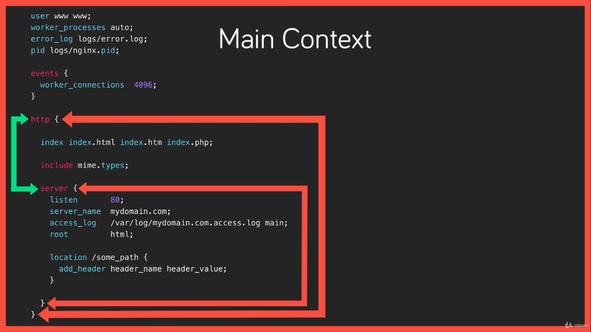

#  Understand the terminology used in Nginx configuration files

- The two main configuration terms is `context` and `directive`.
    - Directives: a specific configuration options that get set in the configuration files and consist of a name and a value.
    - context: is sections within the configuration where directives can be set for that given context. Context are also nested and inherit from their parents with the topmost context simply being the configuration file itself.
        - This is called the main context and is where we configure global directives that apply to the master process.
        - The important contexts include 
            - The http context for anything http related.
            - The server context, which is where we define a virtual host similar to an Apache V host.
            - Location context for matching URL locations on incoming requests to the parent server context.

