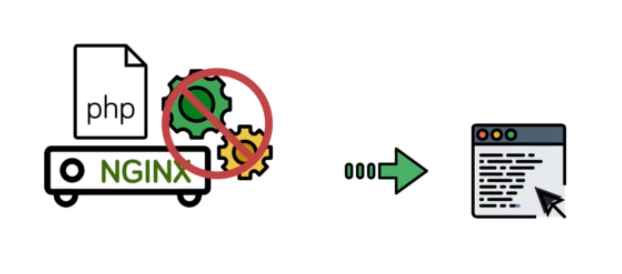
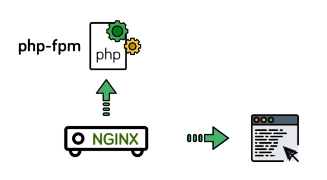
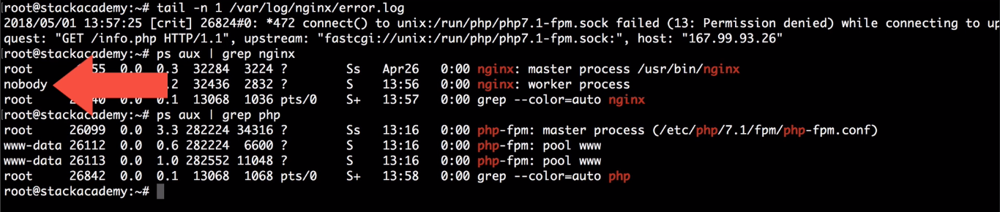

# [PHP Processing]

- We've dealt with and configured engines to serve static files of various types, leaving the rendering of that file to be handled by the client or browser based on content type or `mime.type`.

- A critical part of most Web servers is the ability to serve dynamic content that's been generated from a server side language such as PHP.


- If you recall, Nginx isn't able to embed its server side language processes.


- So instead then we'll configure a standalone service, namely FPM, to which Nginx will pass the request for processing and then upon receiving the response, typically as HTML return that to the client.


- Step one then is to actually install the FPM service.
```
sudo apt update
```
- Install the latest stable release of FPM available to apt.
```
sudo apt install php-fpm
```

- As with most services we install using apt, php-fpm is very conveniently already configured as a systemd service, same as we've done for Nginx.

- We can confirm that the service exists by listing all the systemd services:
```
systemctl list-units | grep php
```

- First edition to this [file](../Code/08%2BPHP%2BProcessing.conf) is the inclusion of the Index Directive, this being a standard directive which tells Nginx which file to load if the request points to a directory. the default or the current value being `index.html`. Hence why when we request our domain / index.html load.
```
/sites/demo/index.html
```

- `index` like the `try_files` directive can take multiple arguments in order of importance.


- So with the inclusion of PHP will typically want to serve index.php first if it exists in a directory and if not secondly, look for index.html the default.
```
index index.php index.html;
```

- Next, create a new location for /. So a prefix match for anything in which we are going to try with files. The requested are then alternatively the requested you arrive with an add a trailing / in case it maps to a directory with either index.php or index.html. And finally, if none of these exist, go back to the default Nginx 404, which we can write with =404.
So this location will take care of any requests for static content.
```
location / {
    try_files $uri $uri/ =404;
}
```

- Second location block using a regular expression match so it will take priority over this prefix match. We can match anything ending in php.
-  In order to pass it to FPM. Which will do by means of the fast CGI protocol (essentially it's a protocol like HDB for transferring binary data.).
-  Before we pass requests in this location context to FPM. However, we still need to include some other configuration parameters.
- Luckily, as with our mime.types, Ingenix provides a very good include with fast CGI pre configured.
```
ls /etc/nginx/
```
- what we want to pass to fastcgi is a Unix socket created by FPM.
```
location ~\.php$ {
    include fastcgi.conf;
    fastcgi_pass unix:/run/php/php7.4-fpm.sock;
}
```
- To find the socket location for your install:
```
find / -name *fpm.sock
```
- create php file through this command:
```
echo '<h1>Date: <?php echo date("l jS F") ?> </h1>' > /sites/demo/index.php
```
- Without change the user which run the nginx to be the same user which run php process you will get 502 Bad Getway. 



- To change the user add this line to the nginx.conf file:
```
user www-data;
```

### `Links`
- [Understanding and Implementing FastCGI Proxying in Nginx](https://www.digitalocean.com/community/tutorials/understanding-and-implementing-fastcgi-proxying-in-nginx)
