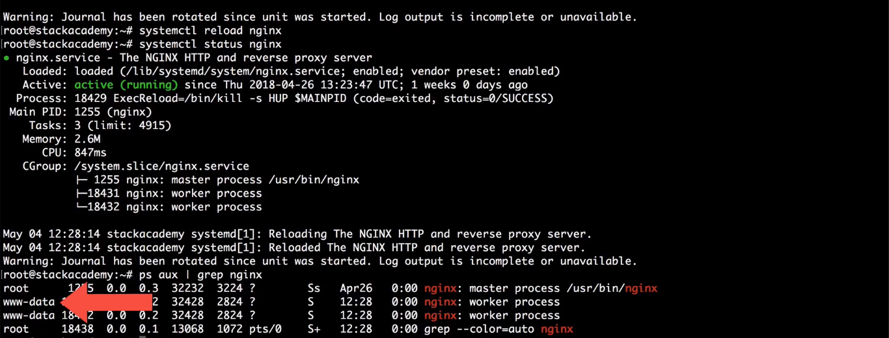

# [Worker Processes](../Code/09%2BWorker%2BProcesses.conf)

- When checking the engine, a status via either systemd, we've seen this differentiation between a `master process` and a `worker process`.


- The `master process` is the actual engine service or software instance, which we started that master process.
- The `worker processes`, which listens for and responds to client requests.
- The default number of worker processes for Engine X being one.
- To change the number of work processes, we can use `worker_processes` in main context.

```
worker_processes 2;
```


- Increasing the number of workers Nginx spawned doesn't necessarily equate to better performance.
- Nginx process, specifically these worker processes handling requests is asynchronous, meaning they will handle incoming requests as fast as the hardware is capable of. And creating a second worker process simply does not increase the hardware's ability.

- That said, without going into too much detail of how CPU's work when we have more than one CPU core, so a dual-core quad-core or even octa-core, those cores cannot share processes, meaning a single Nginx worker process can only ever run on a single CPU core. And with that basic knowledge, then we can 99% of the time configure Nginx to run the exact number of processes as the server CPU has, cause it's just that simple.


- To know number of cores, use this commands:
```
nproc
```
```
lscpu
```

- But as I mentioned, Nginx gives us a very simple way of automating this by simply setting this directive to auto.
```
worker_processes auto;
```

- The next related directive will finally jump us into this event context, `worker_connections`, this sets the number of connections each worker process can accept.  not a number we can simply increase.
- Your server has a limit to how many files can be open at once for again, each CPU core.
- You can again quickly check that open file limit:
```
ulimit -n
```
```
event{
    worker_connections 1024;
}
```