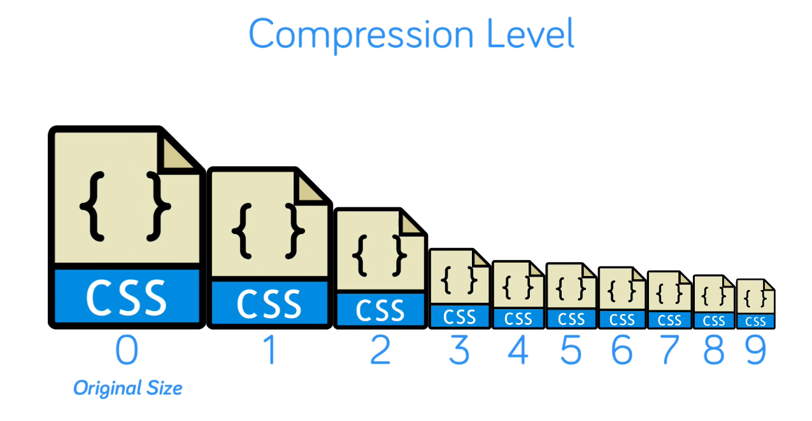

# [Configuring Compressed Responses](../Code/13%2BCompressed%2BResponses%2Bwith%2Bgzip.conf)


- What this means is when a client requests a resource, typically a static file such as JavaScript or access, that client can indicate its ability to accept compressed data.

- All modern browsers being capable of this, meaning we can compress a response on the server, typically using `gzip`, which drastically reduces its size and as a result reduces the time it takes for the client to receive that response  which the client or browse in this case then has the responsibility of decompressing before rendering it.

- Step one, then, is enabling gzip compression in the HTP context:
```
gzip on;
```

- Configuring amount of compression used:
- A lower number resulting in larger files, but requiring less server resources and a larger number resulting in smaller files but requiring more server resources.
```
gzip_comp_level 3;
```


- Note, that at levels over five, the reduction in file size or response size becomes very minor. So three or four to be a good option, a decent amount of compression without the need for much work on the service part.

- Set the file types or mime types to apply this compression to:
```
gzip_types text/css text/javascript;
```

- Remember, the client still needs to indicate that they're willing to accept a compressed response before this will happen, which from the previous lesson is where this very header comes in.

# SEE VIDEO AGAIN

## `Links`
- [Module ngx_http_gzip_module](http://nginx.org/en/docs/http/ngx_http_gzip_module.html)
