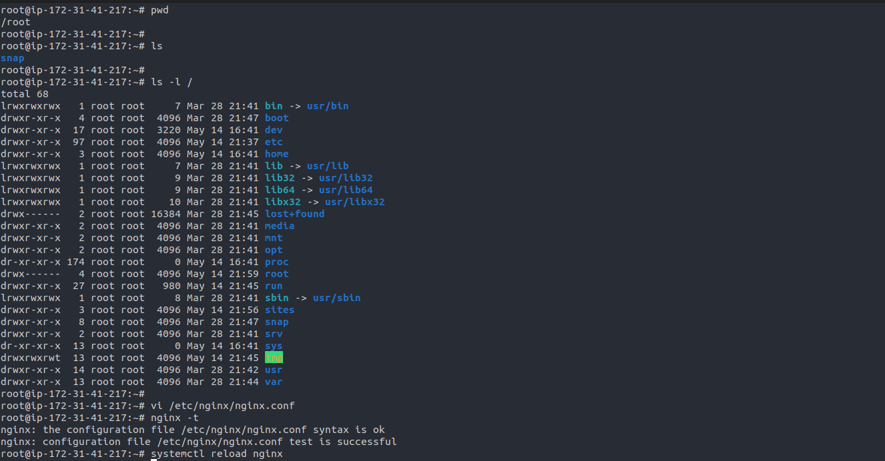
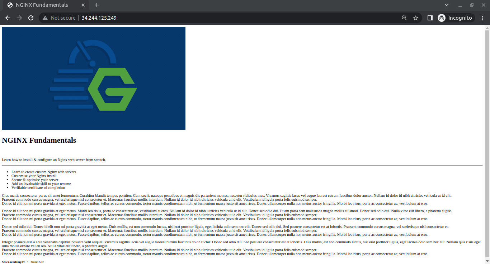

# [Creating a basic virtual host](../01%2BCreating%2Ba%2BVirtual%2BHost.conf)

### creating a basic virtual host to serve static files from a directory on our server.
- To demonstrate this, I've created a directory called Sites [demo-site](../demo-site.zip) at the root of my server 
- Inside demo-site: I've uploaded a very simple single page website.
- The files I've uploaded consists of a single HTML file indexed on HTML access file, which is linked to in indexed HTML and a PMG image.

- The main configuration file we're going to edit is `etc/nginx/nginx.conf`, which at the moment is still serving that default holding page.

> Note that even though we won't be adding anything to the event context, we do need to keep it for the configuration to be considered valid.


- First: we're going to want to define a virtual host, each virtual host being a new `server context` or server block like so a virtual host or server context is essentially responsible for listening on a port:
    - 80  => http
    - 443 => https
- Define the root directive. this being the root path from which Ingenix will be serving requests or interpreting static requests

```
server { 
    listen 80;
    server_name 167.99.93.26;

    root /sites/demo;
  }
```

- For these changes to take effect, we'll have to reload the Nginx configuration using our Systemd service.
```
systemctl reload nginx 
```



- The result: we get this rather ugly HTML page.


> The problem here is that we don't have any styles applied from that linked style.css file. \
> So what's happening here is that Nginx is sending the wrong mind type with the stylesheet. We can confirm this by requesting the style.
```
curl -I http://167.99.98.25/style.css
```


- So to fix this,  Nginx allows us to include pieces of configuration from separate files. And one of those files that already exist is the `mime.types` file in `/etc/nginx`.
- `mime.types` Contains that very type's context we just created, but with a much more complete selection of mime types already defined, including variations of file extensions such as jpeg and jpg.

```
include mime.types;
```

- Then reload again:
```
systemctl reload nginx 
```

